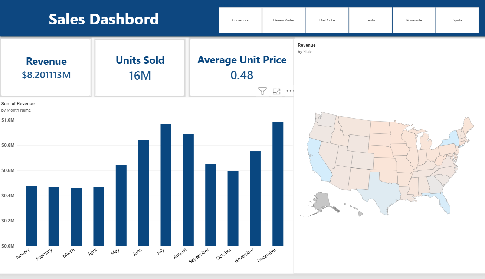

# Sales Dashboard – Power BI Project

An interactive Power BI dashboard analyzing beverage sales performance across products, time, and geography.

## Overview

This dashboard was built to give a quick, decision-ready view of sales performance for a beverage company, covering six product lines (Coca-Cola, Dasani Water, Diet Coke, Fanta, Powerade, and Sprite). It combines high-level KPIs with trend and geographic analysis to support both executive summaries and drill-down exploration.

## Key Metrics

| Metric | Value |
|---|---|
| Total Revenue | $8.20M |
| Units Sold | 16M |
| Average Unit Price | $0.48 |

## Features

- **Product filter buttons** – instantly slice all visuals by individual product
- **KPI cards** – Revenue, Units Sold, and Average Unit Price at a glance
- **Monthly revenue trend chart** – reveals seasonality, with a clear peak in July and December
- **Revenue by state map** – geographic breakdown of where sales are concentrated across the US

## Tools & Skills Used

- Power BI Desktop
- Data modeling
- DAX measures (Revenue, Units Sold, Average Unit Price)
- Interactive filtering and cross-visual highlighting
- Geospatial visualization

## Key Insights

- Sales show clear seasonality, with revenue peaking in **July** and **December**
- **December and July** are the strongest-performing months, likely tied to summer demand and holiday season respectively
- Revenue distribution varies notably by state, suggesting opportunities for regional marketing focus

## Files in This Repo

- `Power_BI_Dashboard.pbix` – the full Power BI project file
- `dashboard_screenshot.png` – preview image of the dashboard

## How to View

Download `Power_BI_Dashboard.pbix` and open it in [Power BI Desktop](https://powerbi.microsoft.com/desktop/) (free) to explore the interactive version.

---

*This project was built as part of my data analytics portfolio.*
